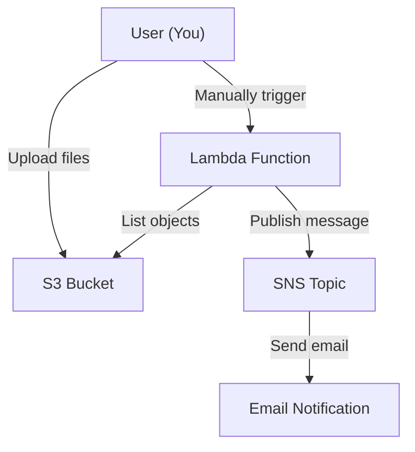

# NICE DevOps Assignment

## Project Overview
This project demonstrates how to build and deploy a fully automated serverless application on AWS using Infrastructure as Code (IaC). It is designed for students learning AWS, DevOps, and serverless concepts.

---

## What is AWS CDK and Why Use It?

**AWS Cloud Development Kit (CDK)** is an open-source software development framework for defining cloud infrastructure in code and provisioning it through AWS CloudFormation.  
**Why use it?**
- Write infrastructure as code in familiar programming languages (like Python).
- Version, review, and reuse your infrastructure just like application code.
- Automate, document, and repeat deployments easily.

---

## Architecture Diagram



---

## Project Structure
```
infra/           # AWS CDK code (Python)
lambda/          # Lambda function code (Python)
sample_files/    # Files to upload to S3 during deployment
invoke_lambda.py # Script to manually trigger Lambda
upload_sample_files.py # Script to upload files to S3
.github/workflows/deploy.yml # GitHub Actions workflow
README.md        # This file
EXPLANATION.md   # (Personal learning only, do NOT commit)
```

---

## Prerequisites
- AWS account with programmatic access (Access Key ID & Secret)
- AWS CLI configured locally (`aws configure`)
- Python 3.8+
- Node.js & npm (for AWS CDK CLI)
- AWS CDK CLI (`npm install -g aws-cdk`)
- Git

---

## Setup & Deployment

### 1. Clone the repository:

```sh
git clone https://github.com/Jadaan59/NICE_DevOps_assignment.git
cd NICE_DevOps_assignment
```

### 2. Install dependencies:

```sh
cd infra
python3 -m venv .venv
source .venv/bin/activate
pip install -r requirements.txt
```

### 3. Bootstrap your AWS environment (first time only):

```sh
cdk bootstrap
```

### 4. Deploy the stack:

```sh
cdk deploy
```
- You will see outputs for the S3 bucket, Lambda, and SNS topic.
- Check your email (the one you set in the code) and confirm the SNS subscription.

#### Example `cdk deploy` Outputs

```
Outputs:
NICEDevOpsAssignmentStack.BucketName = my-devops-assignment-bucket
NICEDevOpsAssignmentStack.LambdaFunctionName = ListS3AndNotifyLambda-abc123
NICEDevOpsAssignmentStack.SnsTopicArn = arn:aws:sns:us-east-1:123456789012:AssignmentTopic
NICEDevOpsAssignmentStack.SnsSubscriptionEmail = student@example.com
```

---

### 5. Upload sample files to S3:
- Add files to the `sample_files/` folder.
- Use the upload script:

```sh
python upload_sample_files.py <YourBucketName>
```

---

## Manual Lambda Test
You can manually trigger the Lambda function for testing:

### Using Python script:
```sh
python invoke_lambda.py <YourLambdaFunctionName>
```

#### Example Output

```
Status code: 200
Response payload: {
  "bucket": "my-devops-assignment-bucket",
  "object_count": 2,
  "objects": ["file1.txt", "file2.txt"],
  "error": null,
  "event": {}
}
```

### Using AWS CLI:
```sh
aws lambda invoke \
  --function-name <LambdaFunctionName> \
  --payload '{}' \
  output.json
```
Replace `<LambdaFunctionName>` with the name output by the CDK deploy.

### Using AWS Console:
- Go to AWS Lambda in the console
- Find your function
- Click "Test" and use an empty event (`{}`)

---

## GitHub Actions CI/CD

- The project includes a GitHub Actions workflow that deploys your stack when manually triggered from GitHub.
- You must add your AWS credentials as GitHub repository secrets.

### Setting Up AWS Credentials as GitHub Repository Secrets

1. In your AWS account, create or use an IAM user with permissions for CDK deployment (CloudFormation, S3, Lambda, IAM, SNS).
2. In the AWS Console, go to **IAM > Users > [Your User] > Security credentials** and create an **Access key**.
3. In your GitHub repository, go to **Settings > Secrets and variables > Actions > New repository secret**.
4. Add the following secrets:
   - `AWS_ACCESS_KEY_ID` – your AWS access key ID
   - `AWS_SECRET_ACCESS_KEY` – your AWS secret access key
   - `AWS_REGION` – your preferred AWS region (e.g., `us-east-1`)

Now you can trigger the workflow from the **Actions** tab in GitHub.

---

## Notes
- This project uses placeholder values for the S3 bucket name and SNS email. Change them in the code before deploying to your own AWS account.
- The S3 bucket and all resources will be **destroyed** if you delete the stack (for learning/demo only).
- For any questions, see the code comments.
- **EXPLANATION.md is for your personal learning and should NOT be committed or pushed to GitHub.** 

---

## Credits

Built by [your name] as part of a NICE DevOps assignment. 