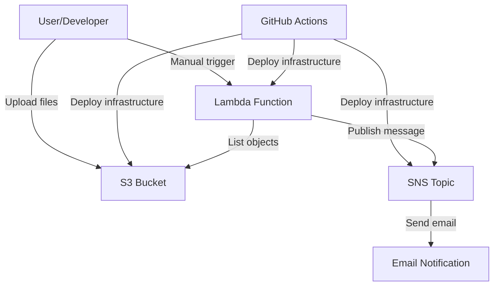

# NICE DevOps Assignment - Serverless AWS Application

## Project Overview

This project demonstrates a fully automated serverless application on AWS using Infrastructure as Code (IaC). The application includes:

- **AWS Lambda Function**: Lists all objects in an S3 bucket and sends email notifications
- **S3 Bucket**: Stores files uploaded during deployment
- **SNS Topic**: Sends email notifications on Lambda execution
- **IAM Roles**: Least-privilege permissions for security
- **GitHub Actions**: Automated CI/CD deployment pipeline

## Architecture



## Project Structure

```
├── requirements.txt              # All project dependencies (CDK, boto3, PyYAML)
├── infra/                       # AWS CDK infrastructure code
│   ├── app.py                   # CDK application entry point
│   ├── infra_stack.py           # Main infrastructure stack
│   ├── setup_env.sh             # Automated environment setup
│   └── cdk.json                 # CDK configuration
├── lambda/                      # Lambda function code
│   └── lambda_function.py       # Main Lambda handler
├── sample_files/                # Files to upload to S3
├── .github/workflows/           # GitHub Actions CI/CD
│   └── deploy.yml              # Deployment workflow
├── invoke_lambda.py             # Manual Lambda trigger script
├── upload_sample_files.py       # S3 upload utility script
└── README.md                   # This file
```

## Prerequisites

- AWS account with programmatic access
- AWS CLI configured (`aws configure`)
- Python 3.8+
- Node.js 18+ and npm
- AWS CDK CLI (`npm install -g aws-cdk`)
- Git

## Quick Start

### 1. Clone and Setup

```bash
git clone https://github.com/Jadaan59/NICE_DevOps_assignment.git
cd NICE_DevOps_assignment
```

### 2. Configure Email (IMPORTANT)

Before deploying, you **must** configure the email address for SNS notifications:

```bash
# Set your email address for SNS notifications
export SNS_EMAIL="your-email@example.com"
```

**Important**: After deployment, check your email and **confirm the SNS subscription** by clicking the confirmation link. You won't receive notifications until you confirm the subscription.

### 3. Install Dependencies

**Option 1: Quick Setup (Recommended)**
```bash
cd infra
./setup_env.sh
```

**Option 2: Manual Setup**
```bash
cd infra
python3 -m venv .venv
source .venv/bin/activate  # On Windows: .venv\Scripts\activate
cd ..
pip install -r requirements.txt
cd infra
```

**Note**: This project uses AWS CDK v2. If you encounter dependency conflicts, the setup script will automatically resolve them by removing any conflicting CDK v1 packages.

### 4. Bootstrap AWS CDK (First Time Only)

```bash
cdk bootstrap
```

### 5. Deploy Infrastructure

```bash
cdk deploy
```

**Expected Output:**
```
Outputs:
InfraStack.BucketName = my-devops-assignment-bucket-123456789012
InfraStack.LambdaFunctionName = InfraStack-ListS3AndNotifyLambda-ABC123
InfraStack.SnsTopicArn = arn:aws:sns:us-east-1:123456789012:InfraStack-AssignmentTopic-ABC123
InfraStack.SnsSubscriptionEmail = your-email@example.com
```

### 6. Upload Sample Files

Files from the `sample_files/` directory will be automatically uploaded to S3 during GitHub Actions deployment. For manual upload:

```bash
# Upload files from sample_files/ directory
python upload_sample_files.py <your-bucket-name>
```

### 7. Post-Deployment Verification

After deployment, verify everything is working:

1. **Check SNS Email Subscription**:
   - Check your email for SNS confirmation message
   - Click the confirmation link to activate notifications

2. **Verify S3 Files**:
   ```bash
   aws s3 ls s3://<your-bucket-name>/
   ```

3. **Test Lambda Function**:
   ```bash
   python invoke_lambda.py <lambda-function-name>
   ```

4. **Check CloudWatch Logs**:
   ```bash
   aws logs tail /aws/lambda/<function-name> --follow
   ```

## Manual Lambda Testing

You can manually trigger the Lambda function to test its functionality and verify SNS notifications.

### Option 1: Python Script (Recommended)

```bash
python invoke_lambda.py <lambda-function-name>
```

**Example Output:**
```json
{
  "bucket": "my-devops-assignment-bucket-123456789012",
  "object_count": 2,
  "objects": ["CS_Gems_Final.pdf", "test.txt"],
  "error": null,
  "event": {},
  "timestamp": 30000
}
```

### Option 2: AWS CLI

```bash
aws lambda invoke \
  --function-name <lambda-function-name> \
  --payload '{}' \
  response.json

# View the response
cat response.json
```

### Option 3: AWS Console

1. Go to AWS Lambda Console
2. Find your function
3. Click "Test" → "Create new event"
4. Use empty event: `{}`
5. Click "Test"

### Expected Results

After successful invocation, you should:
- Receive an email notification from SNS (if subscription is confirmed)
- See the Lambda response with bucket information
- Check CloudWatch logs for detailed execution logs

## GitHub Actions CI/CD

The project includes automated deployment via GitHub Actions.

### Setup GitHub Secrets

1. Go to your GitHub repository → Settings → Secrets and variables → Actions
2. Add these repository secrets:
   - `AWS_ACCESS_KEY_ID`: Your AWS access key
   - `AWS_SECRET_ACCESS_KEY`: Your AWS secret key
   - `AWS_REGION`: Your AWS region (e.g., `us-east-1`)
   - `SNS_EMAIL`: Your email for notifications (required for SNS subscription)

### Trigger Deployment

1. Go to Actions tab in GitHub
2. Select "Deploy CDK Stack"
3. Click "Run workflow"
4. Select branch and click "Run workflow"

## Configuration

### Environment Variables

| Variable | Description | Default |
|----------|-------------|---------|
| `SNS_EMAIL` | Email for SNS notifications | `your-email@example.com` |
| `AWS_REGION` | AWS region for deployment | `us-east-1` |

### Customization

- **S3 Bucket Name**: Modify `bucket_name` in `infra/infra_stack.py`
- **Lambda Timeout**: Adjust `timeout` parameter in Lambda configuration
- **Email Address**: Set `SNS_EMAIL` environment variable

## Dependencies

All project dependencies are consolidated in `requirements.txt`:

- **AWS CDK v2**: Infrastructure as Code framework
- **boto3**: AWS SDK for Python (Lambda function and utility scripts)
- **PyYAML**: YAML parser (GitHub Actions workflow validation)

## Security Features

- **Least-Privilege IAM**: Lambda role has minimal required permissions
- **S3 Bucket Security**: Private bucket with proper access controls
- **SNS Topic Security**: Secure topic with email subscription only
- **Environment Variables**: Sensitive data passed via environment variables

## Troubleshooting

### Common Issues

1. **CDK Import Errors**
   - If you see import errors for `aws_cdk`, run the setup script: `./setup_env.sh`
   - This ensures only CDK v2 packages are installed (removes conflicting v1 packages)
   - The setup script automatically resolves dependency conflicts

2. **Email Not Received**
   - Check spam folder
   - Confirm SNS subscription in email (click the confirmation link)
   - Verify email address in environment variable
   - Check SNS topic in AWS Console for subscription status

3. **Lambda Invocation Fails**
   - Check function name is correct
   - Verify AWS credentials are configured
   - Check CloudWatch logs for errors

4. **S3 Upload Fails**
   - Verify bucket name is correct
   - Check AWS credentials have S3 permissions
   - Ensure files exist in `sample_files/` directory

5. **Node.js Version Warnings**
   - If you see warnings about untested Node.js versions, silence them with:
   ```bash
   export JSII_SILENCE_WARNING_UNTESTED_NODE_VERSION=true
   ```

### Useful Commands

```bash
# Check CDK status
cdk diff

# Destroy infrastructure
cdk destroy

# View CloudWatch logs
aws logs tail /aws/lambda/<function-name> --follow

# List S3 objects
aws s3 ls s3://<bucket-name>

# Test all dependencies
source infra/.venv/bin/activate
python -c "from aws_cdk import Stack; import boto3; import yaml; print('✅ All dependencies working!')"
```

## Technologies Used

- **AWS CDK v2**: Infrastructure as Code framework
- **AWS Lambda**: Serverless compute
- **Amazon S3**: Object storage
- **Amazon SNS**: Notification service
- **IAM**: Identity and access management
- **GitHub Actions**: CI/CD automation
- **Python**: Programming language
- **Boto3**: AWS SDK for Python

---

**Built with ❤️ using AWS CDK and Python by Gidon Abbas.** 